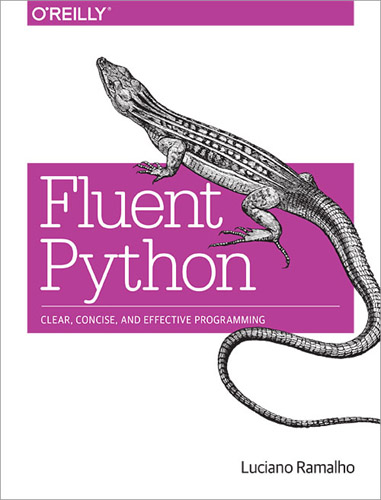

# Fluent Python, Лучано Рамальо

Книга рассматривает тонкие аспекты языка, разбирает часто решаемые задачи (и часто решаемые неправильно!). Она находится примерно посередине между голой теорией и чистой практикой. В книге нет готовых инструкций к решению задачи, но подробно описывается как к этому решению можно прийти самостоятельно.

[книги по программированию](./meta_knigi_po_programmirovaniy.md)

[python](./meta_python.md)

[книги](./meta_knigi.md)

### О чём книга

* Работа со словарём через его неизменяемое отображение - с.106.
* Пример паттерна Стратегия- с.199.
* Специфические декораторы- с.214.
* Слабые ссылки - с.265.
* Интерфейсы и абстрактные классы- с.338.
* Работа с корутинами- с.494.
* Работа с Future- с.536.
* Работа с asyncio- с.567.
* Динамическая манипуляция атрибутами объекта- с.614.
* Дескрипторы- с.653.
* Метаклассы- с.682.