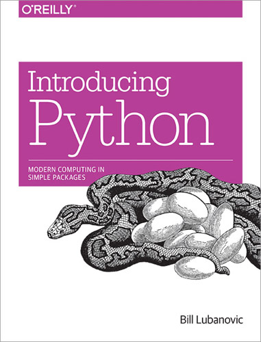

# Простой Python, Билл Любанович

Книга для самых зелёных новичков, описывает манипуляции с примитивными типами
данных, функции, базовую структуру класса. Подойдёт только для тех, кто python
видит в первый раз в жизни.

[книги по программированию](./meta_knigi_po_programmirovaniy.md)

[python](./meta_python.md)

[книги](./meta_knigi.md)

### О чём книга

* Для новичков — всё.
* Для знающих программирование — почти ничего.